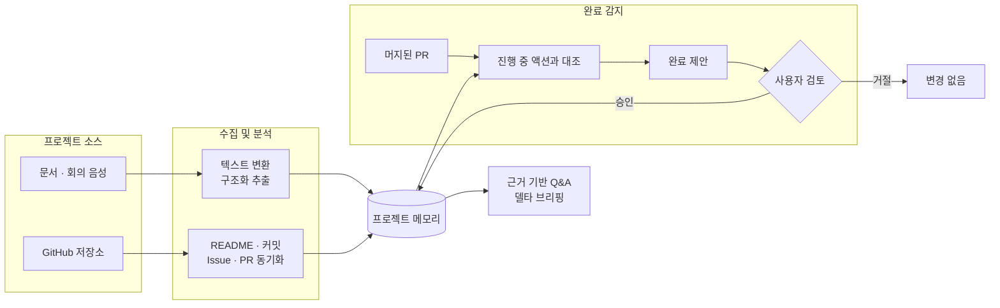
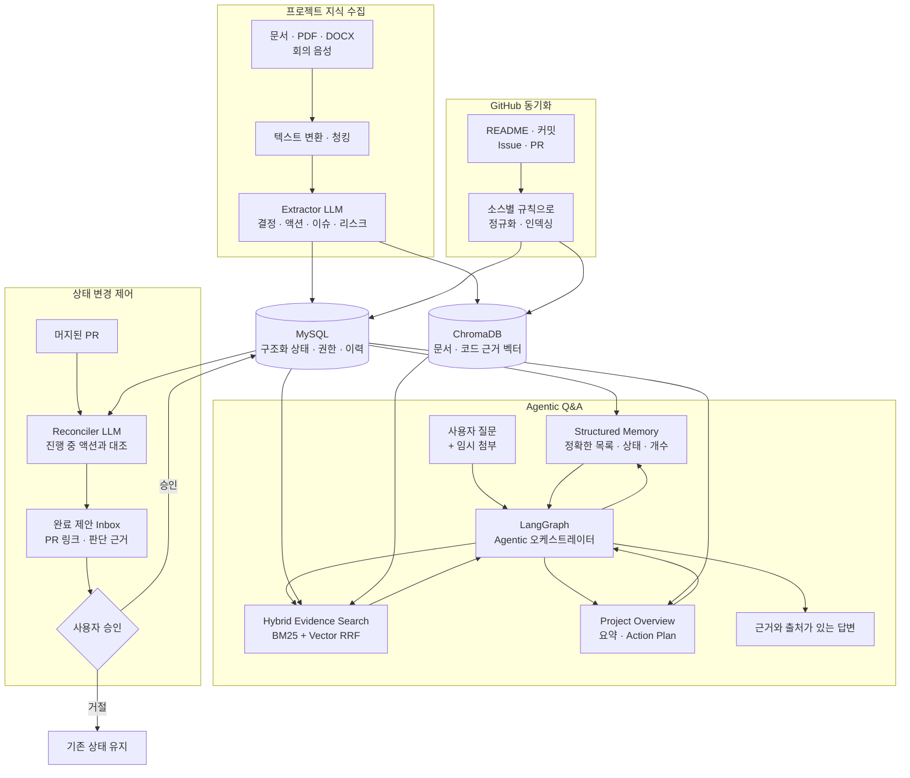

# PaiM — Project AI Manager

> 회의와 코드 사이의 맥락을 기억하는 AI 프로젝트 매니저

PaiM은 회의록, 문서, 음성 기록과 GitHub 활동을 하나의 **프로젝트 메모리**로 연결합니다.
흩어진 기록에서 결정·할 일·이슈·리스크를 정리하고, 프로젝트의 현재 상태를 근거와 함께 답하며, 머지된 PR이 기존 할 일을 해결했는지 찾아 완료를 제안합니다.

[최신 버전 다운로드](https://github.com/SKNETWORKS-FAMILY-AICAMP/SKN30-4th-1Team/releases) · [문서 모음](docs/README.md) · [API 명세](docs/API_명세서.md) · [배포 가이드](deploy/README.md)


## PaiM이 하는 일

- **프로젝트 메모리** — 문서에서 결정, 액션, 이슈, 리스크를 구조화해 관리합니다.
- **근거 기반 Q&A** — SQL 상태 조회와 하이브리드 검색을 조합해 출처가 있는 답변을 만듭니다.
- **GitHub 동기화** — README, 커밋, Issue, PR을 프로젝트 맥락에 연결합니다.
- **완료 제안** — 머지된 PR과 진행 중인 액션을 대조하고, 사용자의 승인 전까지 제안으로만 남깁니다.
- **델타 브리핑** — 마지막 확인 이후의 진행, 신규 항목, 마감 임박 사항을 요약합니다.
- **문서·음성 입력** — 텍스트, Markdown, PDF, DOCX와 회의 녹음을 프로젝트 메모리로 변환합니다.
- **팀 워크스페이스** — 로그인, 프로젝트 멤버와 역할, 공유 프로젝트를 지원합니다.
- **데스크톱 경험** — React와 Tauri 기반의 macOS·Windows 앱을 제공합니다.

## 작동 방식



PaiM은 프로젝트 상태를 임의로 확정하지 않습니다. 새 정보는 메모리에 축적하되, 액션 완료처럼 기존 상태를 바꾸는 일은 근거를 제시한 뒤 사람의 승인을 받습니다.

## AI 아키텍처

PaiM은 질문 유형을 미리 고정하는 라우터 대신, 하나의 **Agentic 오케스트레이터**가 질문에 필요한 읽기 전용 도구를 직접 선택합니다. 정답이 명확해야 하는 상태 정보는 MySQL에서 조회하고, 문서의 맥락은 키워드와 벡터를 결합한 하이브리드 검색으로 찾습니다.



### 핵심 기술 선택

| 문제 | 구현 | 선택 이유 |
| --- | --- | --- |
| 담당자·상태·개수처럼 정확해야 하는 질문 | MySQL 구조화 조회 | LLM의 추측과 검색 누락 방지 |
| 문서 표현이 달라도 같은 맥락 찾기 | BM25 + Vector Search를 RRF로 결합 | 키워드 일치와 의미 유사도의 장점 결합 |
| 질문마다 필요한 근거가 다름 | LangGraph Agentic 도구 호출 | 고정 라우팅 없이 여러 근거를 조합 |
| README·커밋·회의록의 의미가 다름 | 소스 유형별 추출 프롬프트 | 설치 문구를 할 일로 오인하는 문제 방지 |
| PR 머지를 액션 완료와 연결 | Reconciler LLM + 근거 기반 제안 | 자동화하면서도 잘못된 완료 처리 방지 |
| AI가 기존 상태를 바꾸는 위험 | 승인·거절이 있는 Human-in-the-loop | 최종 결정권을 사용자에게 유지 |

### 서비스 구성

| 영역 | 기술 |
| --- | --- |
| Desktop | Tauri 2 · React 19 · TypeScript · Vite |
| Backend | FastAPI · Python 3.11+ |
| AI | LangGraph · LangChain · OpenAI |
| Data | MySQL 8 · ChromaDB |
| Search | BM25 · Vector Search · Reciprocal Rank Fusion |
| Operations | Docker Compose · Caddy · AWS · GitHub Actions |
| Security | JWT 인증 · 프로젝트 역할 기반 권한 · Rate Limit · Storage Quota |

## 주요 화면

### 프로젝트 채팅

프로젝트 자료와 GitHub 활동을 근거로 질문하고, 오른쪽 도구에서 메모리·자료·저장소를 함께 확인합니다.


| 프로젝트 메모리 | GitHub 연결 |
| --- | --- |
|  |  |

## 시작하기

### 데스크톱 앱 설치

1. [GitHub Releases](https://github.com/SKNETWORKS-FAMILY-AICAMP/SKN30-4th-1Team/releases)에서 운영체제에 맞는 설치 파일을 받습니다.
   - macOS: `.dmg`
   - Windows: `-setup.exe` 또는 `.msi`
2. PaiM을 설치하고 실행합니다.
3. 계정을 만들거나 로그인한 뒤 프로젝트를 생성합니다.
4. 문서나 회의 녹음을 추가하고, 필요하면 GitHub 저장소를 연결합니다.

> macOS에서 확인되지 않은 개발자 경고가 표시되면 **시스템 설정 → 개인정보 보호 및 보안 → 그래도 열기**를 선택하세요.

데스크톱 앱은 배포된 PaiM 서버에 연결됩니다. 사용자가 별도로 백엔드나 데이터베이스를 실행할 필요는 없습니다.

## 개발

### 데스크톱

요구사항:

- Node.js LTS
- Rust와 Cargo
- macOS: Xcode Command Line Tools
- Windows: MSVC Build Tools, WebView2

```bash
npm ci --prefix desktop
npm run demo --prefix desktop
```

프로덕션 설치본 빌드:

```bash
npm run app:build --prefix desktop
```

## 문서

- [시스템 아키텍처](docs/ARCHITECTURE.md)
- [API 명세](docs/API_명세서.md)
- [배포 운영 가이드](deploy/README.md)
- [Agentic Q&A 검증](docs/AGENTIC_QA_MVP_VALIDATION.md)

## Team

| 이름 | 역할 | 주요 기여 |
| --- | --- | --- |
| [서해연](https://github.com/hellohaeyeon) | Team Lead · PM | 프로젝트 기반 구축, SQL, FastAPI |
| [박제섭](https://github.com/j3s30p) | Developer | 데스크톱 앱, LangGraph·API 고도화, 릴리즈 |
| [김동휘](https://github.com/star9906) | Developer | 대화·암호화, 업로드 정합성, LangGraph |
| [이동욱](https://github.com/attatae01-svg) | Developer | LangChain·LangGraph, RAG 개선 |
| [이승민](https://github.com/robinlee3803-ai) | Developer | RAG 검증 데이터, 합성 평가 데이터 |
