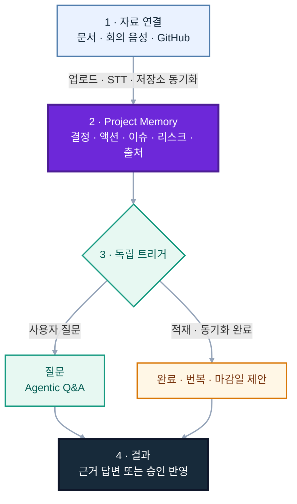
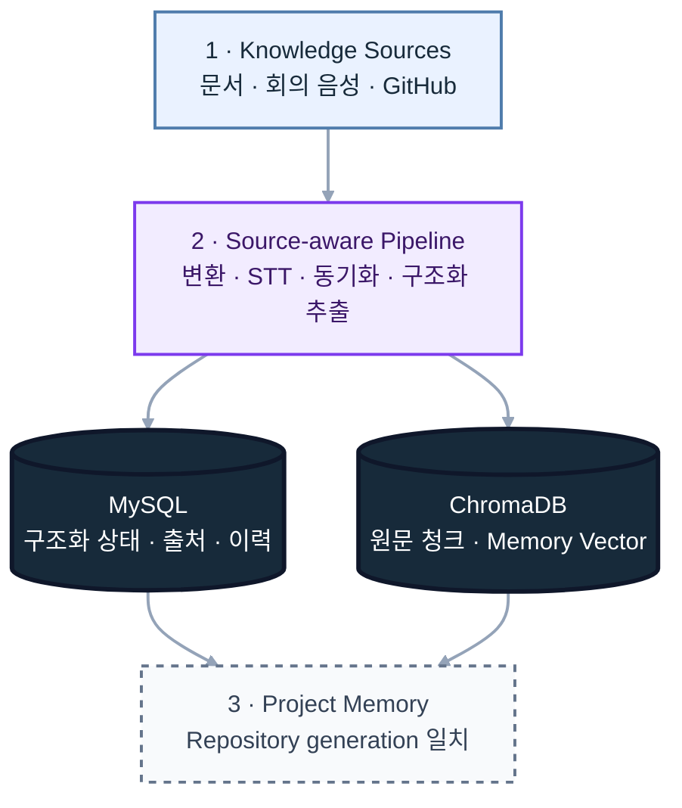
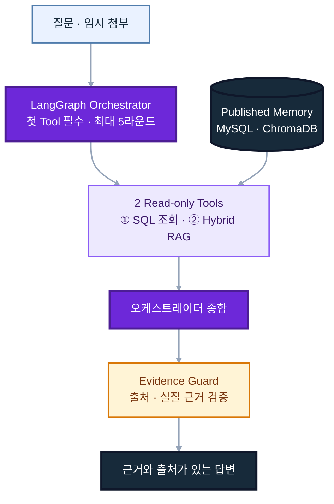
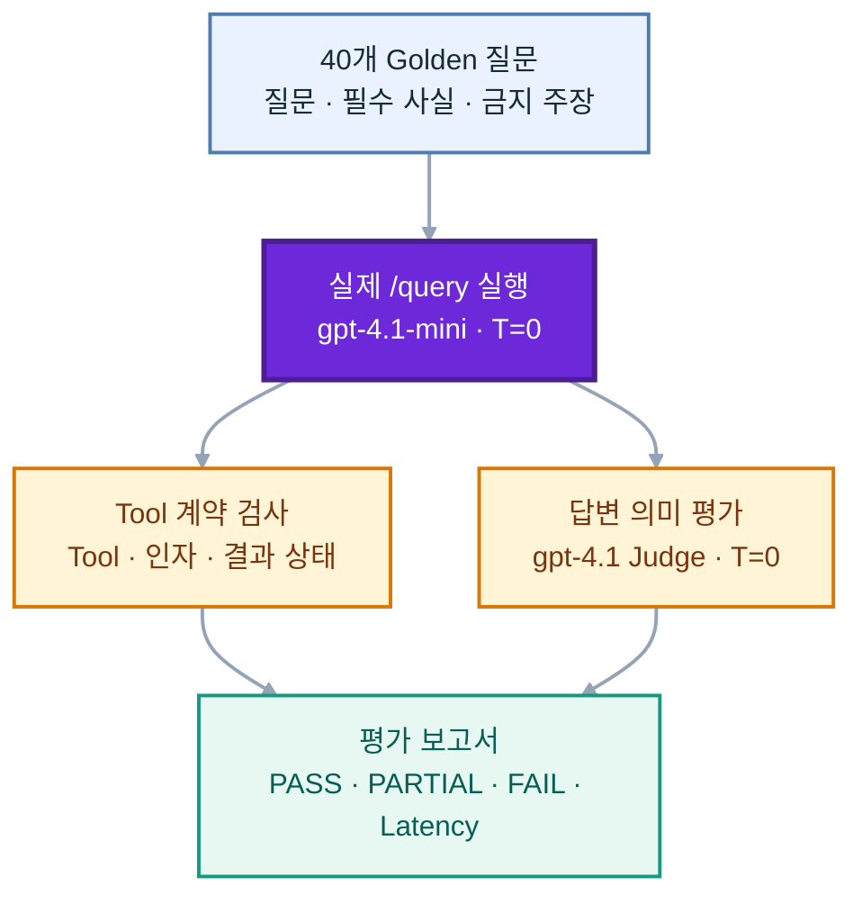
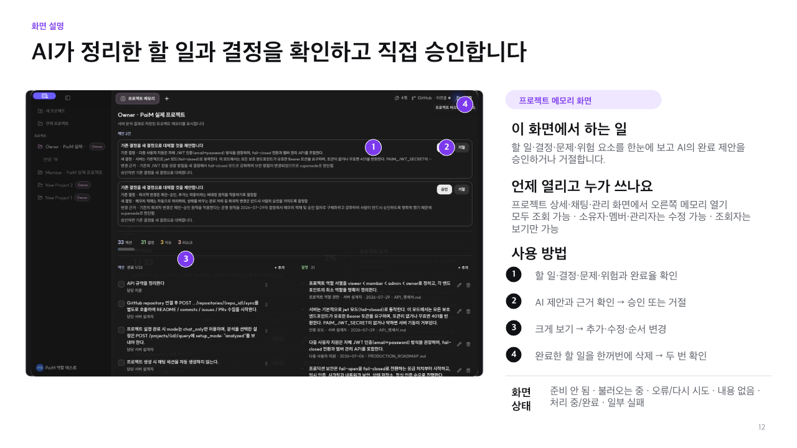
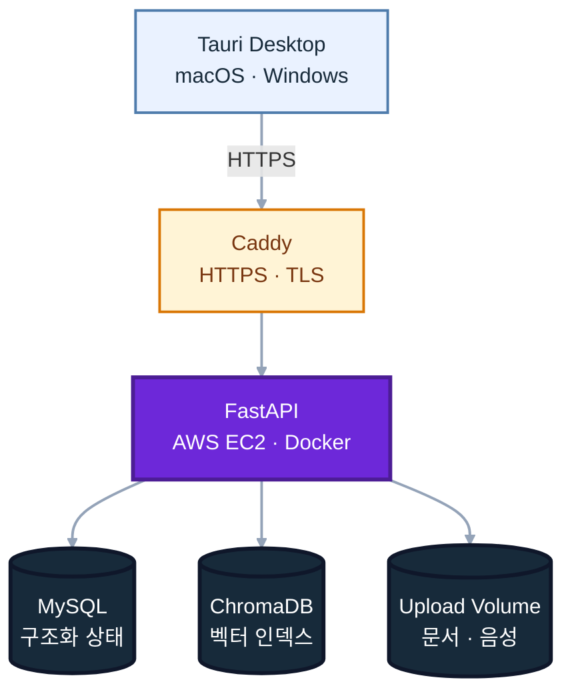

# PaiM — Project AI Manager

> 회의와 실행 사이의 맥락을 기억하는 AI 프로젝트 매니저

PaiM은 회의록, 문서, 음성 기록과 GitHub 활동을 하나의 **프로젝트 메모리**로 연결합니다.
흩어진 기록에서 결정·할 일·이슈·리스크를 정리하고, 프로젝트의 현재 상태를 출처와 함께 답하며, 저장소 동기화에서 확인한 머지 PR이 기존 할 일을 해결했는지 찾아 완료를 제안합니다.

[PaiM v1.0.7 다운로드](https://github.com/SKNETWORKS-FAMILY-AICAMP/SKN30-4th-1Team/releases/tag/v1.0.7) · [문서 모음](docs/README.md) · [API 명세](docs/API_명세서.md) · [배포 가이드](deploy/README.md)


## Team

<table>
  <tr>
    <td align="center" width="180">
      <a href="https://github.com/hellohaeyeon">
        <br/>
        <b>서해연</b>
      </a><br/>
      <sub>Team Lead · PM</sub><br/>
      <sub>FastAPI · 인증 · Supersede<br/>평가 파이프라인 · 배포 하드닝</sub>
    </td>
    <td align="center" width="180">
      <a href="https://github.com/j3s30p">
        <br/>
        <b>박제섭</b>
      </a><br/>
      <sub>Developer</sub><br/>
      <sub>Tauri Desktop · Agentic Q&A<br/>GitHub 연동 · 릴리즈</sub>
    </td>
    <td align="center" width="180">
      <a href="https://github.com/star9906">
        <br/>
        <b>김동휘</b>
      </a><br/>
      <sub>Developer</sub><br/>
      <sub>세션 보안 · 대화 암호화<br/>업로드 정합성 · 멀티포맷</sub>
    </td>
    <td align="center" width="180">
      <a href="https://github.com/attatae01-svg">
        <br/>
        <b>이동욱</b>
      </a><br/>
      <sub>Developer</sub><br/>
      <sub>Agentic 오케스트레이터 · Hybrid RAG<br/>평가 파이프라인 · 검색 품질 개선</sub>
    </td>
    <td align="center" width="180">
      <a href="https://github.com/robinlee3803-ai">
        <br/>
        <b>이승민</b>
      </a><br/>
      <sub>Team Support</sub><br/>
      <sub>팀 운영 지원<br/>식사 및 현장 지원</sub>
    </td>
  </tr>
</table>

## PaiM이 하는 일

- **프로젝트 메모리** — 문서에서 결정, 액션, 이슈, 리스크를 구조화해 관리합니다.
- **근거 기반 Q&A** — SQL 상태 조회와 하이브리드 검색을 조합해 출처가 있는 답변을 만듭니다.
- **GitHub 동기화** — README, 커밋 메시지, Issue, PR의 제목·본문을 프로젝트 맥락에 연결합니다.
- **완료 제안** — 머지된 PR과 진행 중인 액션을 대조하고, 사용자의 승인 전까지 제안으로만 남깁니다.
- **결정 이력 관리** — 새 결정이 기존 결정을 대체하는지 찾아 번복 후보를 제안합니다.
- **마감일 보호** — 상대 날짜와 연도가 생략된 날짜는 자동 반영하지 않고 검토 후보로 남깁니다.
- **델타 브리핑** — 마지막 확인 이후의 진행, 신규 항목, 마감 임박 사항을 요약합니다.
- **문서·음성 입력** — 텍스트, Markdown, PDF, DOCX와 회의 녹음을 프로젝트 메모리로 변환합니다.
- **팀 워크스페이스** — 로그인, 프로젝트 멤버와 역할, 공유 프로젝트를 지원합니다.
- **데스크톱 경험** — React와 Tauri 기반의 macOS·Windows 앱을 제공합니다.

## 프로젝트 목표

- 비정형 회의 기록을 결정·액션·이슈·리스크로 구조화할 수 있는가?
- 회의에서 정한 할 일을 GitHub의 머지 PR과 활동 근거에 연결할 수 있는가?
- 담당자·상태·마감처럼 정확해야 하는 질문에 LLM의 추측 없이 답할 수 있는가?
- 자동화의 편의성과 사람의 최종 결정권을 함께 지킬 수 있는가?

## 작동 방식



두 갈래는 동시에 실행되는 한 파이프라인이 아닙니다. Q&A는 사용자의 질문으로 시작하고, 완료·번복·마감일 제안은 새 PR이나 메모리가 확인될 때만 실행됩니다. 상태 변경은 사용자가 승인한 뒤에만 반영됩니다.

## AI 아키텍처

PaiM은 질문 유형을 미리 고정하는 라우터 대신, 하나의 **LangGraph Agentic 오케스트레이터**가 두 개의 읽기 전용 도구를 직접 선택합니다. 목록·개수·프로젝트 조망은 `query_sql_state`가 MySQL에서 조회하고, 이유·맥락·변경 이력은 `search_hybrid_vector_rag`가 MySQL과 ChromaDB의 근거를 결합해 찾습니다.

### 데이터 적재와 프로젝트 메모리



문서 적재는 구조화 항목을 MySQL에, 원문 청크와 구조화 memory vector를 ChromaDB에 저장합니다. 저장소 동기화는 새 generation을 staging한 뒤 게시 범위를 원자적으로 전환해 두 저장소가 같은 세대만 조회하도록 맞춥니다.

### Agentic Q&A



오케스트레이터는 질문마다 두 읽기 전용 Tool 중 필요한 경로를 선택하고, 서버는 Tool 결과의 출처와 실질 근거를 다시 검증한 뒤 답변을 반환합니다.

### 상태 변경 안전장치

| 독립 트리거 | 검사 | 처리 |
| --- | --- | --- |
| 저장소 동기화에서 새 머지 PR 확인 | 열린 액션과 완료 근거 대조 | 완료 제안 |
| 새 결정 적재 | 기존 결정과 번복 관계 판별 | Supersede 제안 |
| 상대 날짜·연도 생략 날짜 추출 | 기준일과 시간 순서 검증 | 마감일 제안 |

세 검사는 Q&A와 별도로 실행되며 결과를 자동 반영하지 않습니다. 모든 항목은 `Pending Suggestions`에 쌓이고 사용자가 승인한 경우에만 프로젝트 메모리에 반영됩니다.

### 핵심 기술 선택

| 문제 | 구현 | 선택 이유 |
| --- | --- | --- |
| 담당자·상태·개수처럼 정확해야 하는 질문 | MySQL 구조화 조회 | LLM의 추측과 검색 누락 방지 |
| 문서 표현이 달라도 같은 맥락 찾기 | Dense 0.4 + BM25 0.4 + Recency 0.2 RRF | 의미·키워드·최신성 신호를 한 순위로 결합 |
| 질문마다 필요한 근거가 다름 | LangGraph의 2-Tool 오케스트레이션 | 고정 라우팅 없이 구조화 상태와 원문 근거를 조합 |
| 근거 없는 자연스러운 답변 위험 | 첫 Tool 호출 강제 · 5라운드 상한 · 중복 차단 · Evidence Guard | 도구 오류와 빈 검색을 성공한 답변으로 포장하지 않음 |
| README·커밋·회의록의 의미가 다름 | 소스 유형별 추출 프롬프트 | 설치 문구를 할 일로 오인하는 문제 방지 |
| 동기화 도중 이전·신규 데이터가 섞이는 위험 | Repository generation staging + atomic publish | MySQL과 ChromaDB가 같은 게시 세대만 조회 |
| 머지 PR을 액션 완료와 연결 | 구조화 Reconciler LLM + 워터마크 | 새 PR만 열린 액션과 비교하고 근거가 있는 제안만 생성 |
| 신규 결정이 기존 방침을 바꾸는 경우 | 벡터 후보 검색 + Supersede 판별 + 시간 역전 차단 | 과거 문서가 최신 결정을 잘못 대체하는 문제 방지 |
| 상대 날짜를 바로 저장하는 위험 | 기준일 검증 + 마감일 승인 후보 | 모델이 계산한 날짜를 사용자 확인 없이 확정하지 않음 |
| AI가 기존 상태를 바꾸는 위험 | 승인·거절이 있는 Human-in-the-loop | 최종 결정권을 사용자에게 유지 |

## 성능 및 품질 검증

### Agentic Q&A

<table>
  <tr>
    <td align="center" width="25%">
      <strong>100%</strong><br/>
      <sub>HTTP 성공<br/>40 / 40</sub>
    </td>
    <td align="center" width="25%">
      <strong>97.5%</strong><br/>
      <sub>Tool 계약 충족<br/>39 / 40</sub>
    </td>
    <td align="center" width="25%">
      <strong>92.5%</strong><br/>
      <sub>답변 통과율<br/>37 / 40</sub>
    </td>
    <td align="center" width="25%">
      <strong>7.5%</strong><br/>
      <sub>FAIL<br/>3 / 40</sub>
    </td>
  </tr>
  <tr>
    <td align="center">
      <strong>4.23초</strong><br/>
      <sub>평균 응답 시간</sub>
    </td>
    <td align="center">
      <strong>6.97초</strong><br/>
      <sub>p95 응답 시간</sub>
    </td>
    <td align="center">
      <strong>9 / 9</strong><br/>
      <sub>문서 적재 성공</sub>
    </td>
    <td align="center">
      <strong>74 / 74</strong><br/>
      <sub>청크 출처 보존</sub>
    </td>
  </tr>
</table>

`routing_v2`는 CS-Bot 21문항과 Modu 19문항으로 구성됩니다. 자연어 근거 검색 14문항, 구조화 상태 조회 13문항, 프로젝트 조망 13문항을 실제 `/query` 경로로 실행해 Tool 선택과 답변을 함께 평가했습니다.



- **PASS · 통과** — 기준 답변의 필수 사실을 빠짐없이 충족
- **PARTIAL · 통과** — 핵심 방향은 맞지만 일정·담당자·수치 같은 세부 사실 일부가 누락
- **FAIL** — 필수 사실과 모순되거나 질문이 요구한 핵심 정보를 충족하지 못함

PaiM은 핵심 요구를 충족한 PASS와 PARTIAL을 모두 통과로 집계합니다. 답변 통과율은 **37/40, 92.5%**이며, 이 중 24건은 필수 사실을 모두 충족했고 13건은 핵심 방향을 충족했지만 일부 세부 사실이 빠졌습니다. 같은 MySQL·ChromaDB snapshot을 사용한 paired 비교에서는 답변 통과율과 Tool 계약을 유지하면서 p95 응답 시간이 9.03초에서 6.97초로 **22.8% 감소**했습니다.

### 문서 적재 E2E

DOCX·PDF 합성 입력 9개를 빈 MySQL·ChromaDB에서 다시 적재해 변환, 청킹, 구조화 추출과 출처 추적을 함께 검사했습니다.

| 확인 항목 | 결과 |
| --- | ---: |
| 파일 처리 완료 | 9/9 `indexed` |
| 원문 청크 생성 | 74개 |
| 출처 metadata 보존 | 74/74 |
| 추출 액션의 담당자 보존 | 45/45 |

표의 여러 열에 나뉜 risk와 3단 중첩 표의 하위 작업은 일부 누락됐고, 자유 양식의 memory 분류는 LLM 실행마다 달라질 수 있었습니다. 성공 수치뿐 아니라 확인된 실패 조건도 후속 개선 대상으로 기록했습니다.

> 위 결과는 목적과 실행 커밋이 서로 다른 검증입니다. 문서 적재 E2E는 `5e124a4`, Agentic Q&A는 후보 `cef6114`에서 실행했습니다. 최신 `main` `d13baba` 전체를 하나의 E2E로 다시 실행한 결과는 아니며, 정식 `agentic_v2` 평가는 동결 state 부재로 미실행 상태입니다.

- [문서 적재 E2E 보고서](docs/reports/validation/DOCUMENT_INGESTION_E2E_REPORT.md)
- [`routing_v2` 문항별 평가](evals/routing_v2/CURRENT_BRANCH_REPORT.md)
- [동일 조건 paired 비교](evals/routing_v2/PAIRED_CLEANUP_COMPARISON_20260731.md)
- [`agentic_v2` 정식 평가 계약](evals/agentic_v2/EVALUATION_CONTRACT.md)

## 기술 스택

| 영역 | 기술 |
| --- | --- |
| Desktop | Tauri 2 · React 19 · TypeScript · Vite |
| Backend | FastAPI · Python 3.11+ 지원 · Python 3.14 운영 이미지 |
| AI | LangGraph · LangChain · OpenAI `gpt-4.1-mini` |
| Data | MySQL 8 · ChromaDB |
| Search | BM25 · Vector Search · Reciprocal Rank Fusion |
| Server Runtime | Docker Compose · Caddy · AWS EC2 |
| Desktop Release | GitHub Actions · macOS Universal · Windows x64 |
| Security | JWT 인증 · 프로젝트 역할 기반 권한 · Rate Limit · Storage Quota |

## 주요 화면

### 프로젝트 채팅

프로젝트 자료와 GitHub 활동을 근거로 질문하고, 오른쪽 도구에서 메모리·자료·저장소를 함께 확인합니다.


| 프로젝트 메모리 | GitHub 연결 |
| --- | --- |
|  |  |

## 시작하기

### 일반 사용자

PaiM은 데스크톱 앱과 배포 서버로 구성됩니다. 사용자는 별도로 백엔드나 데이터베이스를 실행하지 않습니다.

1. [PaiM v1.0.7](https://github.com/SKNETWORKS-FAMILY-AICAMP/SKN30-4th-1Team/releases/tag/v1.0.7)에서 운영체제에 맞는 설치 파일을 받습니다.
   - macOS: `PaiM-1.0.7-darwin-universal.dmg`
   - Windows: `PaiM-1.0.7-windows-x64-setup.exe` 또는 `.msi`
2. PaiM을 설치하고 실행합니다.
3. 계정을 만들거나 로그인한 뒤 프로젝트를 생성합니다.
4. 문서나 회의 녹음을 추가하고, 필요하면 GitHub 저장소를 연결합니다.

프로덕션 설치본에는 PaiM 서버 주소가 포함되어 있으며 주요 기능은 네트워크와 서버 연결이 필요합니다.

> 현재 설치본은 코드 서명·공증이 적용되지 않아 운영체제 보안 경고가 표시될 수 있습니다. macOS에서는 **시스템 설정 → 개인정보 보호 및 보안 → 그래도 열기**로 실행할 수 있습니다.

## 개발

### 데스크톱 개발

요구사항:

- Node.js 22 LTS
- Rust stable과 Cargo
- macOS: Xcode Command Line Tools
- Windows: MSVC Build Tools, WebView2

```bash
npm ci --prefix desktop

# desktop/.env에 공개 설정을 준비합니다.
cp desktop/.env.example desktop/.env

# desktop/.env의 VITE_PAIM_API_BASE_URL을 사용할 서버 주소로 바꿉니다.
npm run demo --prefix desktop
```

`desktop/.env`의 `VITE_*` 값은 데스크톱 번들에 포함되는 공개 설정입니다. API 키나 비밀번호 같은 비밀 값은 넣지 않습니다. 배포 서버에 개발 앱을 연결하려면 서버의 `CORS_ORIGINS`에 `http://127.0.0.1:7420`이 허용되어 있어야 합니다.

프로덕션 설치본 빌드:

```bash
npm run app:build --prefix desktop
```

### 테스트

```bash
# 데스크톱 계약 테스트
npm test --prefix desktop

# TypeScript 검사와 Vite 프로덕션 빌드
npm run build --prefix desktop

# 정식 백엔드 게이트:
# 비통합 pytest → 격리 MySQL → migrate_v9 2회 → MySQL 통합 pytest
./tests/integration/mysql/run.sh
```

백엔드 게이트는 Git, uv, Docker Compose, Bash 4+와 GNU `realpath`가 있는 Linux 환경이 필요합니다. macOS 기본 Bash 3.2는 배포·하네스 계약 테스트의 실행 환경이 아닙니다. GitHub Actions는 `v*` 태그에서 데스크톱 계약 테스트와 설치본 빌드만 수행하며, 백엔드 전체 게이트와 서버 배포는 자동 실행하지 않습니다.

## 배포 구조



PaiM 서버는 AWS EC2의 Docker Compose 스택으로 운영합니다. 외부에는 Caddy의 80·443 포트만 공개하고 FastAPI·MySQL은 내부 네트워크에 둡니다. 데스크톱 릴리스는 별도로 `v*` 태그에서 GitHub Actions가 테스트·빌드해 GitHub Releases에 게시합니다. 서버 배포는 운영자가 `deploy/stack.sh`를 통해 수행하며, 환경변수·백업·복구·롤백 절차는 [배포 운영 가이드](deploy/README.md)를 따릅니다.

## 문서

- [시스템 아키텍처](docs/ARCHITECTURE.md)
- [API 명세](docs/API_명세서.md)
- [배포 운영 가이드](deploy/README.md)
- [Agentic Q&A 검증](docs/AGENTIC_QA_MVP_VALIDATION.md)
